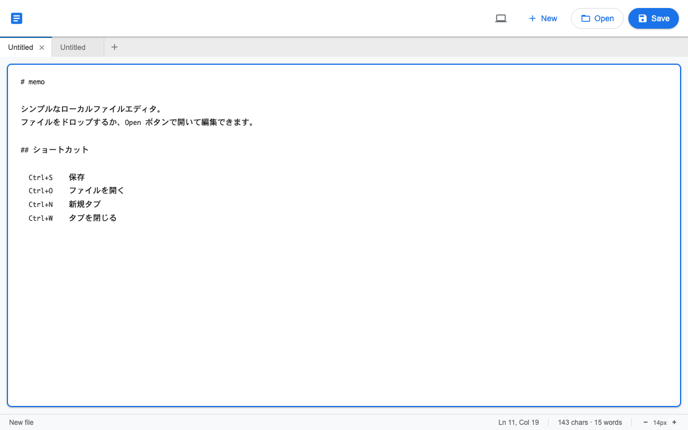

# memo

A single-file local text editor that reads and writes files directly from the browser.



## Usage

Just open `index.html` in Chrome — no install, no server required.

```
open index.html
```

## Features

- **Multi-tab** — open and switch between multiple files simultaneously
- **Read/write** — save directly to disk via the File System Access API
- **Drag & drop** — drop files anywhere on the window to open them (multiple files at once)
- **Themes** — light / dark / system
- **Font size** — adjust with the `−`/`+` controls in the status bar or keyboard shortcuts

## Shortcuts

| Action | Shortcut |
|---|---|
| New tab | `Ctrl/Cmd + N` |
| Open file | `Ctrl/Cmd + O` |
| Save | `Ctrl/Cmd + S` |
| Save As | `Ctrl/Cmd + Shift + S` |
| Close tab | `Ctrl/Cmd + W` |
| Increase font size | `Ctrl/Cmd + =` |
| Decrease font size | `Ctrl/Cmd + -` |
| Switch tabs | `←` / `→` (when tab is focused) |

## Requirements

Chrome 86+ (File System Access API).

Other browsers support reading files and drag & drop, but not direct overwrite saving.
